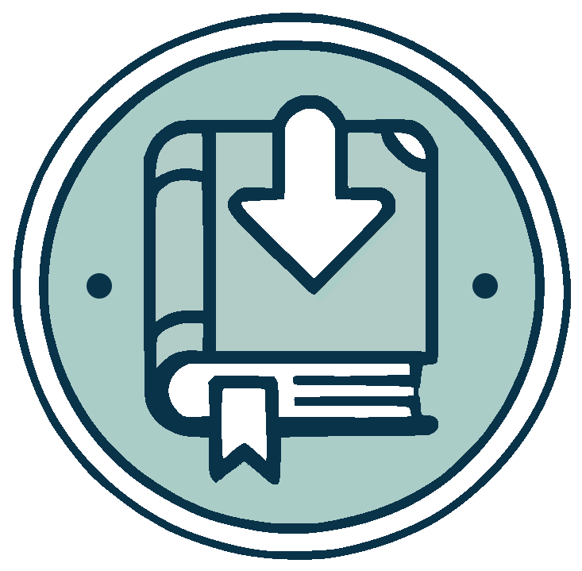

# 📚 Calibre-Web Automated Book Downloader



A unified web interface for searching and downloading books from multiple sources — all in one place. Works out of the box with popular web sources, no configuration required. Add metadata providers, additional release sources, and download clients to create a single hub for building your digital library.

**Fully standalone** — no external dependencies required. Works great alongside library tools like [Calibre-Web-Automated](https://github.com/crocodilestick/Calibre-Web-Automated) or [Booklore](https://github.com/booklore-app/booklore) for automatic import.

## ✨ Features

- **One-Stop Interface** - A clean, modern UI to search, browse, and download from multiple sources in one place
- **Real-Time Progress** - Unified download queue with live status updates across all sources
- **Two Search Modes**:
  - **Direct Download** - Search and download from popular web sources
  - **Universal Mode** - Search metadata providers (Hardcover, Open Library) for richer book discovery and multi-source downloads *(additional sources in development - coming soon!)*
- **Format Support** - EPUB, MOBI, AZW3, FB2, DJVU, CBZ, CBR and more
- **Cloudflare Bypass** - Built-in bypasser for reliable access to protected sources
- **PWA Support** - Install as a mobile app for quick access
- **Docker Deployment** - Up and running in minutes

## 🖼️ Screenshots


## 🚀 Quick Start

### Prerequisites

- Docker & Docker Compose

### Installation

1. Download the docker-compose file:
   ```bash
   curl -O https://raw.githubusercontent.com/calibrain/calibre-web-automated-book-downloader/main/docker-compose.yml
   ```

2. Start the service:
   ```bash
   docker compose up -d
   ```

3. Open `http://localhost:8084` and configure your settings via the Settings button

That's it! Most configuration is done through the web interface.

### Volume Setup

```yaml
volumes:
  - /your/download/path:/cwa-book-ingest  # Where downloaded books go
```

Books are downloaded to `/cwa-book-ingest` inside the container. Mount this to wherever you want books saved on your host system.

> **Tip**: If using Calibre-Web-Automated, point this to your CWA ingest folder for automatic import.

> **Note**: If your volume is on a CIFS share, add `nobrl` to your mount options to avoid "database locked" errors.

## ⚙️ Configuration

### Search Modes

**Direct Download Mode** (default)
- Searches popular web sources directly
- Returns downloadable releases immediately
- Best for: Quick searches when you know what you want

**Universal Mode**
- First searches metadata providers (Hardcover, Open Library) for book information
- Then finds downloadable releases from multiple configured sources
- Best for: Discovering books, browsing by author, multi-source downloads

Set the mode via the Settings UI or `SEARCH_MODE` environment variable.

### Settings UI

All settings are configurable through the web interface. Click the Settings button in the header to access:

| Tab | What You Can Configure |
|-----|------------------------|
| **General** | Ingest directory, supported formats, language preferences, filename format |
| **Direct Download** | Source URL, donator key, download preferences |
| **Cloudflare** | Bypass mode (internal/external), external resolver URL |
| **Network** | DNS settings, proxy configuration |
| **Advanced** | Retry settings, custom scripts, content-type folders |
| **Hardcover** | API key for Hardcover metadata provider |
| **Open Library** | Settings for Open Library metadata provider |

Settings are persisted and take effect immediately.

### Environment Variables

Environment variables are supported for initial setup and Docker deployments. They serve as defaults that can be overridden in the Settings UI.

**Essential variables:**

| Variable | Description | Default |
|----------|-------------|---------|
| `FLASK_PORT` | Web interface port | `8084` |
| `INGEST_DIR` | Book download directory | `/cwa-book-ingest` |
| `TZ` | Container timezone | `UTC` |
| `UID` / `GID` | Runtime user/group ID | `1000` / `100` |
| `SEARCH_MODE` | `direct` or `universal` | `direct` |

All other settings can be configured through the Settings UI.

## 🐳 Docker Variants

### Standard
```bash
docker compose up -d
```

### Tor Variant
Routes all traffic through Tor for enhanced privacy:
```bash
curl -O https://raw.githubusercontent.com/calibrain/calibre-web-automated-book-downloader/main/docker-compose.tor.yml
docker compose -f docker-compose.tor.yml up -d
```

**Notes:**
- Requires `NET_ADMIN` and `NET_RAW` capabilities
- Timezone is auto-detected from Tor exit node
- Custom DNS/proxy settings are ignored

### External Cloudflare Resolver
Use FlareSolverr or ByParr instead of the built-in bypasser:
```bash
curl -O https://raw.githubusercontent.com/calibrain/calibre-web-automated-book-downloader/main/docker-compose.extbp.yml
docker compose -f docker-compose.extbp.yml up -d
```

Configure the resolver URL in the Settings UI under the Cloudflare tab.

**When to use external vs internal bypasser:**
- **External** is useful if you already run FlareSolverr for other services (saves resources) or if you rarely need bypassing
- **Internal** (default) is faster and more reliable for most users - it's optimized specifically for this application

## 🔐 Authentication

Authentication is optional but recommended for shared or exposed instances. Enable it in the Settings UI under the General tab, then create users with username and password.

**Alternative**: If you're running Calibre-Web, you can reuse its user database by mounting it:

```yaml
volumes:
  - /path/to/calibre-web/app.db:/auth/app.db:ro
```

## Health Monitoring

The application exposes a health endpoint at `/api/status`. Add a health check to your compose:

```yaml
healthcheck:
  test: ["CMD", "curl", "-sf", "http://localhost:8084/api/status"]
  interval: 30s
  timeout: 30s
  retries: 3
```

## Logging

Logs are available via:
- `docker logs <container-name>`
- `/var/log/cwa-book-downloader/` inside the container (when `ENABLE_LOGGING=true`)

Log level is configurable via the Settings UI or `LOG_LEVEL` environment variable.

## Development

```bash
# Frontend development
make install     # Install dependencies
make dev         # Start Vite dev server (localhost:5173)
make build       # Production build
make typecheck   # TypeScript checks

# Backend (Docker)
make up          # Start backend via docker-compose.dev.yml
make down        # Stop services
make refresh     # Rebuild and restart
```

The frontend dev server proxies to the backend on port 8084.

### Architecture

```
┌─────────────────────────────────────────┐
│            Web Interface                │
│       (React + TypeScript + Vite)       │
├─────────────────────────────────────────┤
│            Flask Backend                │
│        (REST API + WebSocket)           │
├───────────────────┬─────────────────────┤
│ Metadata Providers│   Release Sources   │
├───────────────────┼─────────────────────┤
│ • Hardcover       │ • Direct Download   │
│ • Open Library    │                     │
└───────────────────┴─────────────────────┘
```

The backend uses a plugin-based architecture for extensibility:
- **Metadata Providers** (`cwa_book_downloader/metadata_providers/`) - Add new book information sources
- **Release Sources** (`cwa_book_downloader/release_sources/`) - Add new download sources

Plugins are self-contained and register themselves automatically via decorators.

## Contributing

Contributions are welcome! Please file issues or submit pull requests on GitHub.

> **Note**: Additional release sources and download clients are under active development. Want to add support for your favorite source? Check out the plugin architecture above and submit a PR!

## License

MIT License - see [LICENSE](LICENSE) for details.

## ⚠️ Disclaimers

### Copyright Notice

This tool can access various sources including those that might contain copyrighted material. Users are responsible for:
- Ensuring they have the right to download requested materials
- Respecting copyright laws and intellectual property rights
- Using the tool in compliance with their local regulations

### Duplicate Downloads

The application does not currently check for existing files in the download directory. Exercise caution when downloading to avoid duplicates.

## Support

For issues or questions, please [file an issue](https://github.com/calibrain/calibre-web-automated-book-downloader/issues) on GitHub.
